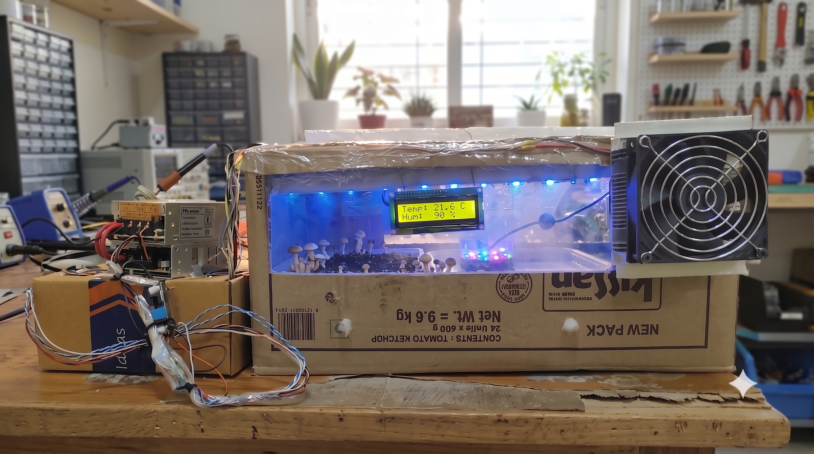
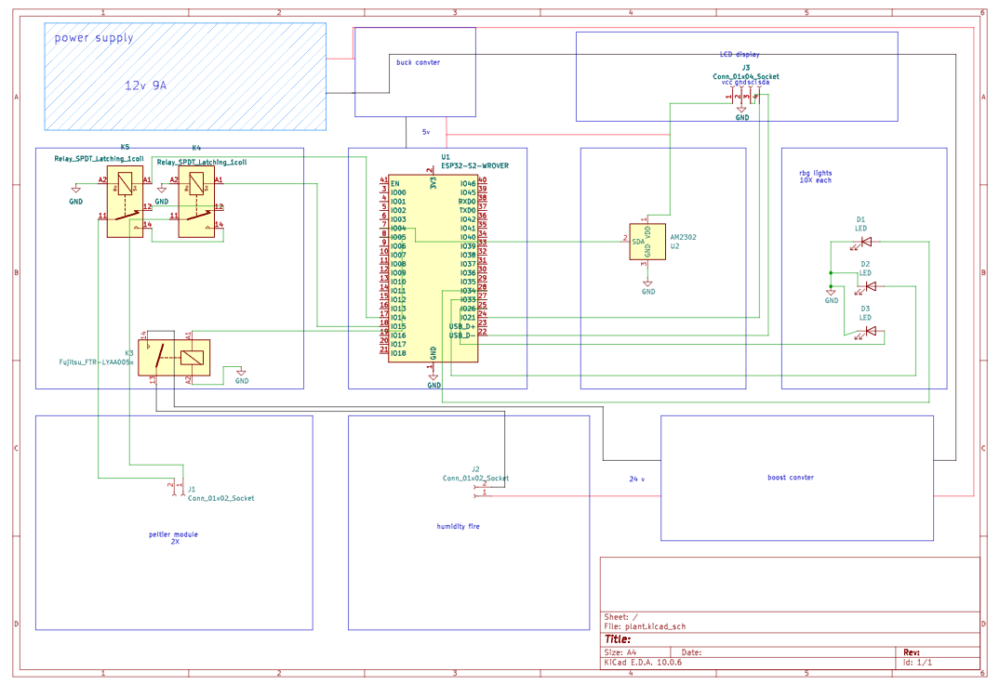

# Plant Management System

Every region of the world has its own unique flavors, but we often experience only the ingredients that grow near us. Many people can access only what their local climate can produce at an affordable price.

What if you could grow plants from completely different climates at home, or find them at a nearby store, without making them prohibitively expensive?

The **Plant Management System** is designed to create suitable growing conditions for plants from different climates by monitoring and controlling temperature, humidity, and lighting. 🌿

## Automation and Android App

The system is designed to operate automatically. Once the target conditions are configured for a plant, the controller continuously checks the DHT22 readings and adjusts the connected temperature, humidity, and lighting devices to help maintain those conditions.

A dedicated Android app lets you control the system and configure its growing conditions. The app is provided as an APK. To make it downloadable from this README, add `plants_mangment.apk` to the project and link it here; the supplied APK is not currently included in the repository.

## system image 

## How It Works

1. A **DHT22 sensor** measures the air temperature and relative humidity inside the growing space.
2. A controller compares these readings with the target conditions selected for the plant.
3. A **Peltier module**, connected through a suitable driver, heats or cools the growing space to help reach the target temperature.
4. A **humidity-control device** adjusts moisture in the air when humidity is outside the target range.
5. **RGB grow lighting** provides adjustable light for the selected plant and its growth needs.

The system repeats this monitoring and adjustment cycle to keep the growing environment closer to the plant's preferred conditions.

## Main Components

- DHT22 temperature and humidity sensor
- Peltier thermoelectric module and suitable driver
- Humidity-control device
- Adjustable RGB grow light
- Controller to read the sensor and operate the devices

Plant-specific target settings should be chosen for the species being grown. The DHT22 provides measurements; the controller and connected devices are what make the adjustments.

## System Schematic

